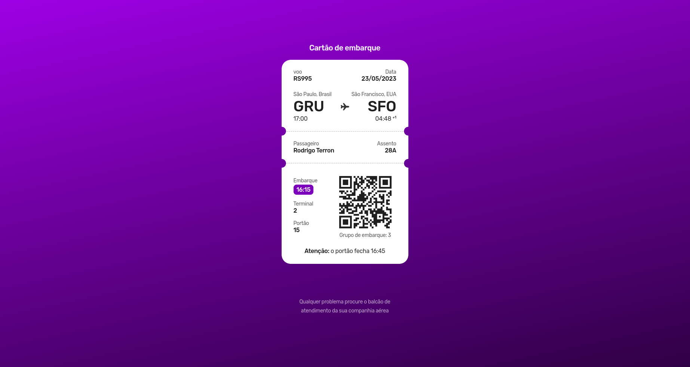

# Um cartão de embarque | Desafio #06


## Sobre o projeto
Desafio utilizando as tecnologias HTML, CSS para montar um layout de um carão de embarque.
Criação de snipet para o VSCode para gerar o CSS inicial, onde está configurado em [css.code-snippets](./.vscode/css.code-snippets).

No CSS foi abordado:
- **Display grid**
- Efeito **linear-gradient** no background
- E principalmente utilizar **mask** que não tinha utilizado anteriormente
    - O mask permite aos usuários alterarem a visibilidade de um item parcialmente ou totalmente escondendo o item. Isso é obtido por qualquer mascaramento ou cortes na imagem em pontos específicos. 
    - sintaxe -> mask: "Imagem url ou podemos tambem gerar uma imagem com o radial-gradient por exemplo";
- **mask-repeat** foi utilizado para corrigir um problema que o background tava aparecendo.fou usado o ```mask-repeat: repeat-x;```
    - A propriedade define como as imagens de máscara são repetidas. Uma imagem de máscara pode ser repetida ao longo do eixo horizontal, do eixo vertical, de ambos os eixos ou não ser repetida.


Para complementar o desafio adicionei um plus no desafio que foi adicionar uma animação para deixar um efeito legal

